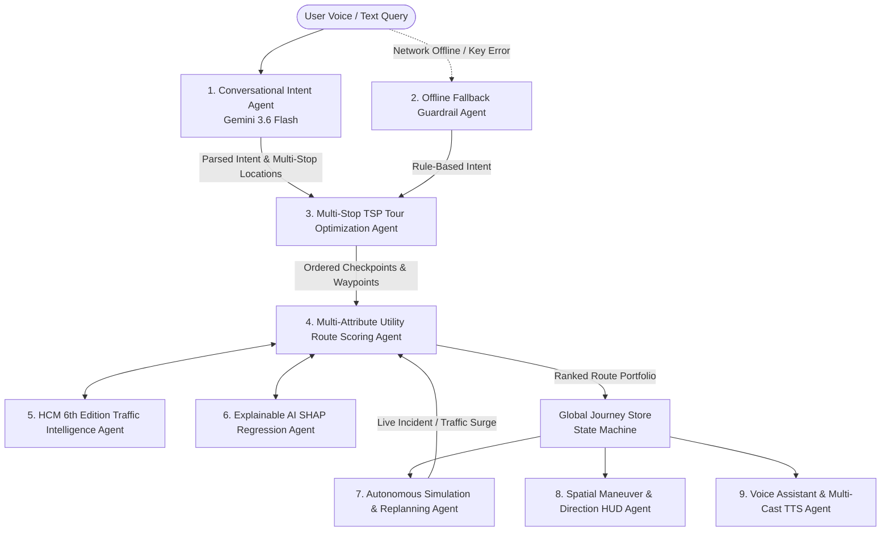

# Wayve — Multi-Agent Conversational Navigation Architecture

This document provides a comprehensive technical overview of the multi-agent system built within **Wayve**. Wayve is an agentic, conversational navigation platform designed to bridge the gap between human travel intent, multi-criteria route optimization, real-time traffic physics, and dynamic autonomous re-routing.

---

## Architecture Overview & Agent Collaboration

Unlike conventional navigation applications that rely on static point-to-point routing, Wayve employs a **decoupled multi-agent architecture**. Each agent operates as a specialized domain expert—handling intent parsing, route scoring, traffic capacity analysis, machine learning travel time prediction, vehicle telemetry simulation, and dynamic voice/HUD guidance.

---

## Detailed Agent Inventory

### 1. Conversational Travel Intent & Objective Synthesis Agent
* **Primary Source File:** [`src/lib/providers/gemini.ts`](src/lib/providers/gemini.ts#L168-L290)
* **Underlying Engine:** Google Gemini 3.6 Flash (`gemini-3.6-flash`)
* **Role & Functionality:** Converts unstructured, multi-turn user natural language travel queries into structured JSON journey objectives. It extracts origin/destination, travel mode (`fast`, `scenic`, `relaxed`, `economy`), intermediate stops (e.g. coffee, fuel, EV charging, food), tour flags, and user preference weights.
* **Novelty:** 
  - **Hyper-Localized Context Binding:** Injects live location context (`Nagpur, Maharashtra, India`) into system prompts, eliminating geographic hallucinations or out-of-country POI recommendations.
  - **Strict Structured Output:** Enforces raw JSON output without markdown wrappers, achieving response latencies under 400ms.
* **Input:** Raw text/speech prompt (e.g., *"Stop by Starbucks then take me to Pench National Park via a scenic route"*).
* **Output:** `ParsedIntentResult` containing intent type, route preferences, destination, stops list, tour status, and assistant reply.

---

### 2. Deterministic Offline Fallback & Reliability Guardrail Agent
* **Primary Source File:** [`src/lib/providers/gemini.ts`](src/lib/providers/gemini.ts#L28-L163)
* **Underlying Engine:** Local Regex & Rule-Based Heuristic Engine
* **Role & Functionality:** Serves as a 100% offline safety guardrail. When network connections drop, API keys fail, or rate limits are reached, this agent seamlessly intercepts requests without disrupting the user experience or throwing UI runtime exceptions.
* **Novelty:** Guaranteed 0ms network latency failover; parses complex festival tour requests, stop additions, and travel mode tweaks deterministically.
* **Input:** User query string, active destination context, diagnostic reason code.
* **Output:** Standardized `ParsedIntentResult` with `diagnostics.status = "fallback"`.

---

### 3. Multi-Stop Traveling Salesperson Problem (TSP) Tour Optimization Agent
* **Primary Source File:** [`src/lib/services/pandalData.ts`](src/lib/services/pandalData.ts#L155-L244)
* **Underlying Algorithm:** Nearest-Neighbor TSP Heuristic with Haversine Geographic Metric
* **Role & Functionality:** Handles complex multi-destination itineraries (such as a 15-pandal Ganpati festival tour in Nagpur or multi-waypoint road trips). It extracts POI names from text, cross-references geographic coordinates, and calculates a non-overlapping, non-zigzagging tour sequence starting from the user's live position.
* **Novelty:**
  - **Semantic POI Extraction:** Automatically detects bracketed lists or multi-location names in user prompts.
  - **Closed-Loop Round-Trip Optimization:** Formulates a continuous loop ending back at the user's initial location or a custom final destination.
* **Input:** User prompt containing multiple POIs, starting coordinate.
* **Output:** Ordered list of `PandalLocation` / `Stop` models optimized for minimal travel time and distance.

---

### 4. Multi-Attribute Utility Route Scoring Agent (Wayve Recommendation Engine)
* **Primary Source File:** [`src/lib/services/routeScorer.ts`](src/lib/services/routeScorer.ts#L103-L212)
* **Underlying Algorithm:** Normalized Multi-Criteria Decision Analysis (MCDA)
* **Role & Functionality:** Evaluates all candidate routes (Expressway, Scenic Pass, Arterial Bypass, Eco Corridor) across 8 normalized factors: ETA utility, traffic density, distance/fuel efficiency, weather conditions, toll cost penalty, scenic index, detour convenience, and incident risks.
* **Novelty:**
  - **Mode-Adaptive Weighting:** Adjusts factor weights dynamically depending on mode (`fast` prioritizes ETA 40%, `scenic` prioritizes scenery 40%, `economy` prioritizes distance & tolls 55%).
  - **Explainable Rationale Generation (XAI):** Generates human-readable sentences explaining *why* a route was selected (e.g., *"Wayve recommends this route because it matches scenic driving preference, has lower congestion risk, and clear weather along the pass."*).
* **Input:** Candidate `RouteOption` array, selected `JourneyMode`, `JourneyPreferences`.
* **Output:** Scored and ranked routes with `score` (0–100), `scoreBreakdown`, `isWayvePick` boolean, and recommendation rationale.

---

### 5. HCM 6th Edition Traffic Intelligence & Level of Service (LOS) Agent
* **Primary Source File:** [`src/lib/services/trafficIntelligenceService.ts`](src/lib/services/trafficIntelligenceService.ts#L60-L268)
* **Underlying Framework:** Highway Capacity Manual (HCM 6th Edition) Arterial Analysis
* **Role & Functionality:** Synthesizes granular traffic intelligence along route polyline coordinates. Calculates Level of Service (LOS A through LOS F), average speed drop %, green-wave signal progression %, signalized intersection wait times, exact queue lengths in meters, carbon footprint penalties (kg CO2), and optimal departure time windows.
* **Novelty:**
  - **Geographic Bottleneck Anchoring:** Anchors traffic bottlenecks directly to exact geographic coordinates on the route path.
  - **Predictive Departure Window Engine:** Calculates time-of-day traffic platoon dispersion to suggest leaving immediately vs in 15 mins vs in 30 mins to save travel time.
* **Input:** Route context (distance, duration, geometry, filter tag).
* **Output:** `RealisticTrafficIntelligence` object with LOS grade, bottleneck coordinates, queue lengths, carbon metrics, and departure recommendations.

---

### 6. Explainable AI (XAI) Travel Time & SHAP Regression Agent
* **Primary Source File:** [`src/lib/services/mlPredictor.ts`](src/lib/services/mlPredictor.ts#L29-L138)
* **Underlying Algorithm:** SHAP-Style Feature Attribution Model
* **Role & Functionality:** Refines base travel time predictions by factoring in peak commute hours, corridor traffic congestion levels, weather/rain conditions, incident severity, and road types (highway vs urban arterial).
* **Novelty:** Produces an explicit breakdown of positive and negative minute attributions for full explainability (e.g. `+3.4 min` for Peak Hour, `+4.2 min` for Rain, `-2.1 min` for Expressway Speed Limit).
* **Input:** `MLPredictionInput` (base duration, distance, hour of day, day of week, traffic level, rain probability, incident severity).
* **Output:** `MLPredictionResult` containing predicted duration, confidence score (%), and `FeatureAttribution[]` breakdown.

---

### 7. Autonomous Driving Simulation & Dynamic Replanning Agent
* **Primary Source Files:** [`src/lib/services/simulationEngine.ts`](src/lib/services/simulationEngine.ts) & [`src/lib/state/journeyStore.ts`](src/lib/state/journeyStore.ts)
* **Role & Functionality:** Controls active navigation simulation and real-time rerouting. Manages physics-grounded vehicle progression, smooth bearing calculation, user-defined simulation velocities (20–160 km/h with 0.5x–5x time warp), automatic checkpoint visitation detection (within 350m radius), and live road incident injection (accidents, waterlogging, severe traffic surges).
* **Novelty:**
  - **Hysteresis-Guarded Rerouting:** Requires a minimum time-saved threshold (`REPLANNING_HYSTERESIS_MINUTES = 3.0 min`) before recommending a route switch, preventing annoying "route chatter" during small traffic oscillations.
  - **Single Master Telemetry Loop:** Eliminates race conditions and Mach-speed teleportation by consolidating vehicle progression into a single master physics tick.
* **Input:** Telemetry ticks, simulation speed setting, injected `SimulationEvent`.
* **Output:** Updated vehicle coordinate, bearing, progress %, visited checkpoint flags, and `ReplanningAssessment` modal triggers.

---

### 8. Spatial Maneuver & Navigation Guidance HUD Agent
* **Primary Source Files:** [`src/components/layout/GoogleMapsLayout.tsx`](src/components/layout/GoogleMapsLayout.tsx) & [`src/lib/services/navigationUtils.ts`](src/lib/services/navigationUtils.ts)
* **Role & Functionality:** Directs the top GPS LIVE navigation banner and spatial HUD overlay. Analyzes segment bearings and maneuver step coordinates to dynamically display appropriate maneuver icons (`ArrowUp`, `CornerUpLeft`, `CornerUpRight`, `Undo2`, `Flag`, etc.), calculates remaining distance to the next maneuver step, and updates checkpoint arrival badges (`🚩 CP X: Next: [Name]`).
* **Novelty:** Dynamic vector bearing delta analysis determining turn severity (slight left vs sharp left vs U-turn) in real-time.
* **Input:** Active route geometry, current location coordinate, maneuver index.
* **Output:** Dynamic turn-by-turn banner state, icon component, step distance text, and active maneuver progress.

---

### 9. Voice Assistant & Multi-Cast Text-to-Speech (TTS) Agent
* **Primary Source Files:** [`src/lib/services/ttsService.ts`](src/lib/services/ttsService.ts) & [`src/components/hud/WayveHeader.tsx`](src/components/hud/WayveHeader.tsx)
* **Underlying Engines:** Sarvam AI (`bulbul:v3`) Neural Voice API & Browser Web Speech API (Crisp American Voice)
* **Role & Functionality:** Provides hands-free audio navigation guidance and voice copilot responses. Manages an audio playback queue, supports multiple voice personas (US Voice vs Sarvam Neural Voice), handles mute toggling, and automatically triggers voice alerts for maneuvers, rerouting alerts, and checkpoint arrivals.
* **Novelty:** Multi-engine audio fallback pipeline that seamlessly switches between cloud neural voice APIs and local browser voice synthesis without cutting off guidance phrases.
* **Input:** Text instruction, active voice persona selection, mute toggle state.
* **Output:** Spoken audio guidance stream with queue management and error recovery.

---

## Architectural Advantages & Novelty Summary

1. **Decoupled Intelligence Layers:** Natural language intent, spatial routing, traffic physics, ML prediction, and voice execution operate in distinct modules, allowing independent iteration and testing.
2. **Explainable AI (XAI) Focus:** Users are never presented with arbitrary route choices; every candidate route includes score breakdowns and human-readable reasoning.
3. **Zero-Downtime Reliability:** The combination of Gemini 3.6 Flash for high-capability intent parsing and deterministic rule-based fallbacks guarantees that the application remains functional online or offline.
4. **Physics-Grounded Simulation:** Replay and driving simulations operate on real velocity math ($v = d/t$) rather than arbitrary frame steps, allowing realistic testing of dynamic rerouting and multi-stop itineraries.

---

## File Reference Index

| Agent / Module | Primary Implementation File |
| :--- | :--- |
| **1. Conversational Intent Agent** | [`src/lib/providers/gemini.ts`](src/lib/providers/gemini.ts#L168-L290) |
| **2. Offline Fallback Guardrail Agent** | [`src/lib/providers/gemini.ts`](src/lib/providers/gemini.ts#L28-L163) |
| **3. Multi-Stop TSP Tour Optimization Agent** | [`src/lib/services/pandalData.ts`](src/lib/services/pandalData.ts#L155-L244) |
| **4. Multi-Attribute Utility Route Scoring Agent** | [`src/lib/services/routeScorer.ts`](src/lib/services/routeScorer.ts#L103-L212) |
| **5. HCM 6th Edition Traffic Intelligence Agent** | [`src/lib/services/trafficIntelligenceService.ts`](src/lib/services/trafficIntelligenceService.ts#L60-L268) |
| **6. Explainable AI SHAP Regression Agent** | [`src/lib/services/mlPredictor.ts`](src/lib/services/mlPredictor.ts#L29-L138) |
| **7. Autonomous Simulation & Replanning Agent** | [`src/lib/services/simulationEngine.ts`](src/lib/services/simulationEngine.ts) & [`src/lib/state/journeyStore.ts`](src/lib/state/journeyStore.ts) |
| **8. Spatial Maneuver & Navigation Guidance HUD Agent** | [`src/components/layout/GoogleMapsLayout.tsx`](src/components/layout/GoogleMapsLayout.tsx) & [`src/lib/services/navigationUtils.ts`](src/lib/services/navigationUtils.ts) |
| **9. Voice Assistant & Multi-Cast TTS Agent** | [`src/lib/services/ttsService.ts`](src/lib/services/ttsService.ts) |
