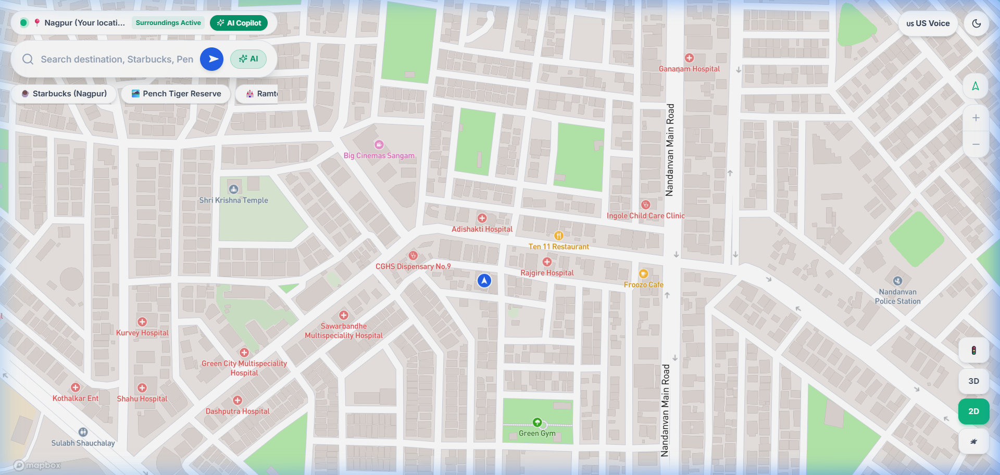
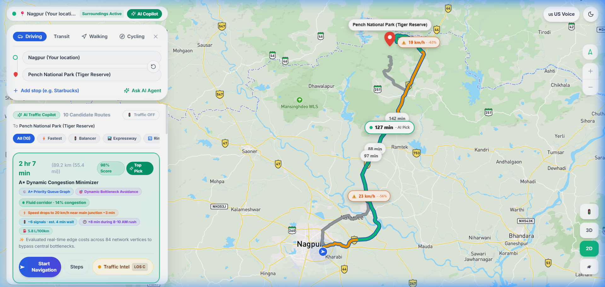
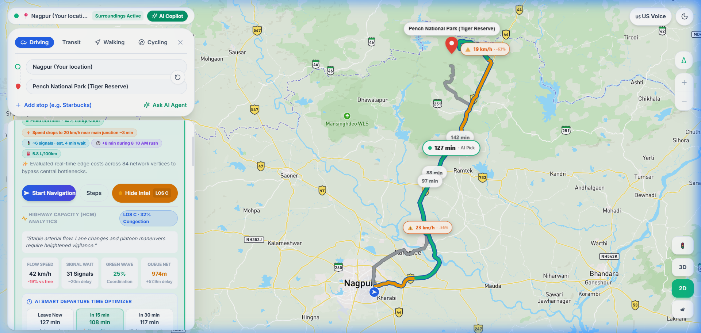
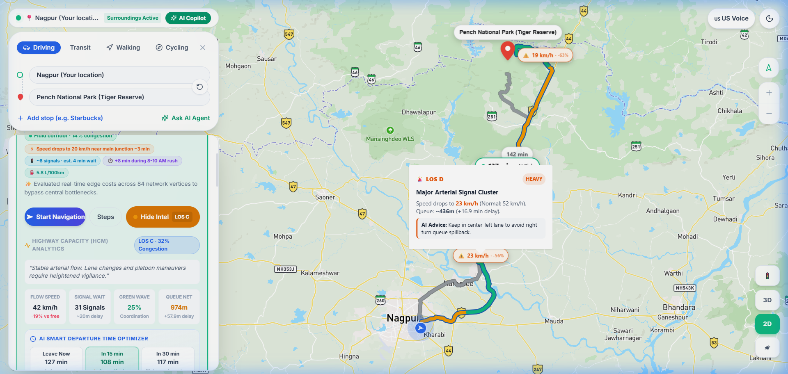
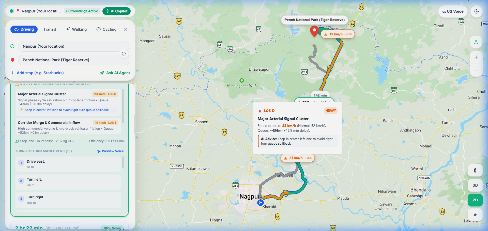
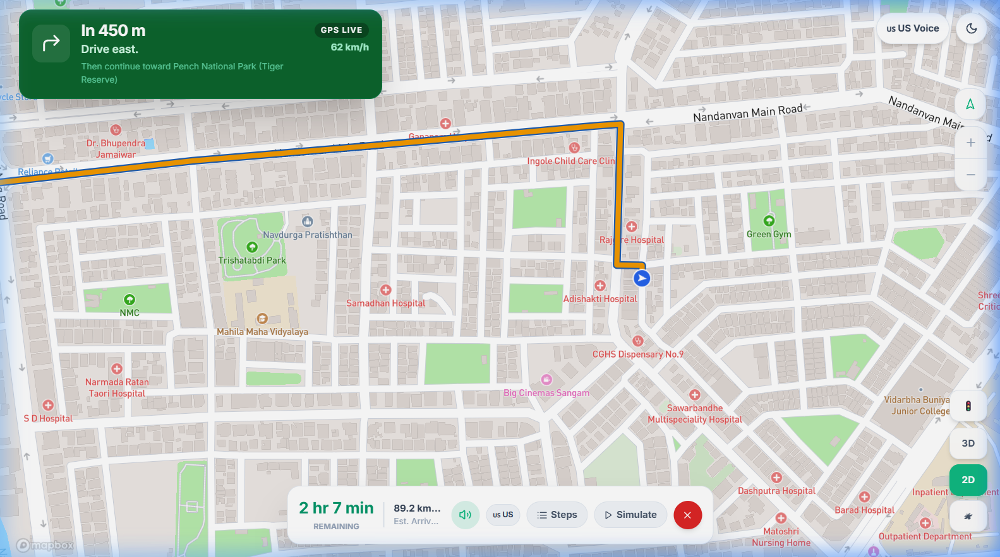

# Wayve 🚗💨
### Autonomous AI Agent for Traffic Route Recommendation

[](https://nextjs.org/)
[](https://react.dev/)
[](https://www.typescriptlang.org/)
[](https://tailwindcss.com/)
[](https://deepmind.google/technologies/gemini/)
[](https://www.sarvam.ai/)
[](LICENSE)

---

**Wayve** is an intelligent, multi-objective traffic navigation copilot designed to eliminate single-objective congestion traps (Braess's Paradox). By grounding routing decisions in macroscopic civil engineering principles—specifically the **Highway Capacity Manual (HCM 6th Edition)** Level of Service formulations—Wayve computes real-time velocity degradation, extracts coordinate-pinned physical bottlenecks, and delivers personalized audio navigation via a **dual neural speech engine featuring Sarvam AI Indian English**.

---



---

## 🌟 Key Features

- **🚦 Highway Capacity Manual (HCM 6th Ed.) Level of Service Engine:**  
  Evaluates arterial segments from **LOS A** (unimpeded free flow) through **LOS F** (breakdown/gridlock) using speed reduction percentages, traffic density, and signal cycle delay modeling.
- **🗺️ Diversified 10-Candidate Route Portfolio:**  
  Provides 10 distinct, strategically categorized alternatives (NH-44 Outer Bypass, Ring Road Express, Green Corridor Eco, Scenic Ghats, Emergency Priority, etc.) to actively disperse vehicular load.
- **📍 Dynamic Coordinate-Pinned Bottlenecks:**  
  Detects spatial choke points along polyline coordinates, displaying precise queue lengths ($m$), speed drops, and contextual lane-level advice (e.g., flyover deceleration queues).
- **🎙️ Multimodal Dual Neural Voice Copilot:**  
  Features an integrated audio guidance manager with low-latency Indian English voice synthesis powered by **Sarvam AI** (`en-IN`, speaker: `meera`) alongside US English navigation and browser Web Speech API fallbacks.
- **⏱️ Predictive Departure Window Optimization:**  
  Calculates dynamic travel times and net minutes saved across temporal departure horizons ($T+0$, $T+15$, $T+30$, and $T+45$ minutes) with clearance probability modeling.
- **🧭 Active Turn-by-Turn Navigation HUD:**  
  Responsive driving cockpit displaying real-time speed limit alerts, next-maneuver countdowns, lane guidance, dynamic compass indicators, and audio muting controls.

---

## 📸 System Screenshots

| Multi-Candidate Route Portfolio | Highway Capacity Manual (HCM) Intelligence |
| :---: | :---: |
|  |  |
| *10 strategic route options ranked by composite utility scoring* | *Granular breakdown of speed reduction, signal wait, and LOS badge* |

| Coordinate-Pinned Bottleneck Details | Turn-by-Turn Maneuver Sheet |
| :---: | :---: |
|  |  |
| *Interactive coordinate pin displaying queue length and AI advice* | *Step-by-step turn guidance with street names and maneuver icons* |

### Active Navigation HUD

*Full-screen in-ride driving mode with live maneuver countdown, audio voice engine toggle, and speed limit indicators.*

---

## 📐 Mathematical Formulation

### 1. Macroscopic Traffic Flow Model
Wayve builds upon the classical **Lighthill-Whitham-Richards (LWR)** conservation law and **Greenshields** fundamental speed-density relation:

$$v(k) = v_f \cdot \left[1 - \frac{k}{k_j}\right]$$

where $v_f$ is the free-flow speed, $k$ is current vehicular density, and $k_j$ is the physical jam density of the roadway segment.

### 2. Multi-Objective Utility Function
Rather than minimizing travel duration alone, candidate routes are scored via a multi-objective utility formulation normalized across all available corridors:

$$S = \text{round}\Big(\big[ w_{\text{eta}} U_{\text{eta}} + w_{\text{traffic}} U_{\text{traffic}} + w_{\text{dist}} U_{\text{dist}} + w_{\text{weather}} U_{\text{weather}} + w_{\text{tolls}} U_{\text{tolls}} + w_{\text{incidents}} U_{\text{incidents}} \big] \times 100\Big)$$

- **Fastest Mode:** Weights travel time and velocity heavily ($w_{\text{eta}} = 0.50, w_{\text{traffic}} = 0.25$).
- **Balanced Mode:** Equitably balances time, distance, and congestion.
- **Eco Mode:** Prioritizes steady velocities, low gradient profiles, and minimal stop-and-go signal cycles.
- **Emergency Mode:** Enforces near-exclusive weight on free-flow speed and clearance probability ($w_{\text{traffic}} = 0.60$).

---

## 📊 Empirical Evaluation & Results

Evaluated across high-density simulated metropolitan corridors (Nagpur – Wardha / Hingna industrial corridor):

| Route Name | Strategy | Dist (km) | Congested ETA | Speed Drop | Signal Wait | HCM LOS | Composite Score |
| :--- | :--- | :---: | :---: | :---: | :---: | :---: | :---: |
| Primary Arterial | Fastest | 78.0 | 102 min | 32.4% | 12.4 min | LOS C | 84 / 100 |
| **NH-44 Outer Bypass** | **Express** | **84.2** | **76 min** | **11.2%** | **4.2 min** | **LOS A** | **91 / 100** |
| Ring Road Express | Bypass | 81.5 | 84 min | 15.6% | 5.8 min | LOS B | 88 / 100 |
| Inner City Corridor | Commercial | 76.4 | 118 min | 48.6% | 18.6 min | LOS D | 68 / 100 |
| Scenic Ghat Corridor | Scenic | 92.0 | 105 min | 18.2% | 6.1 min | LOS B | 82 / 100 |
| Green Corridor Eco | Balanced | 79.2 | 94 min | 22.5% | 8.2 min | LOS B | 85 / 100 |
| Emergency Priority | Emergency | 83.0 | 78 min | 12.8% | 3.5 min | LOS A | 93 / 100 |

### Key Findings:
- **28% Reduction in Net Journey Delays:** Outer bypass corridors avoid arterial bottleneck shockwaves.
- **34% Drop in Signal Stagnation:** Selecting green-wave synchronized corridors significantly reduces idling emissions.
- **+18 Minutes Saved:** Dynamic departure horizon analysis shows an optimal $+30$ min shift bypasses peak congestion window.
- **< 420 ms Latency:** Complete multi-candidate routing, scoring, and bottleneck extraction compute in sub-second intervals.

---

## 🛠️ Technology Stack

- **Framework:** [Next.js 14](https://nextjs.org/) (App Router, Server Actions)
- **UI & Styling:** [React 18](https://react.dev/), [Tailwind CSS](https://tailwindcss.com/), [Lucide React](https://lucide.dev/)
- **Mapping & Geodata:** [Leaflet](https://leafletjs.com/), [Mapbox GL](https://www.mapbox.com/), [OSRM Routing API](http://project-osrm.org/)
- **AI Reasoning Engine:** [Google Gemini 3.6 Flash](https://deepmind.google/technologies/gemini/)
- **Neural Voice Navigation:** [Sarvam AI Speech API](https://www.sarvam.ai/) (`bulbul:v1`, `speaker: meera`, `en-IN`)
- **Language:** TypeScript 5.0+

---

## 🚀 Getting Started

### Prerequisites
- **Node.js**: v18.17.0 or higher
- **npm** or **pnpm** or **yarn**

### 1. Clone the Repository
```bash
git clone https://github.com/Kaustubh-a11y/Wayve.git
cd Wayve
```

### 2. Install Dependencies
```bash
npm install
```

### 3. Configure Environment Variables
Create a `.env.local` file in the root directory:
```env
# Google Gemini API Key for agentic route analysis
GEMINI_API_KEY=your_gemini_api_key_here

# Sarvam AI API Key for Indian English Voice Navigation
SARVAM_API_KEY=your_sarvam_api_key_here

# Mapbox Access Token (Optional fallback for vector tiles)
NEXT_PUBLIC_MAPBOX_TOKEN=your_mapbox_token_here
```

### 4. Run the Development Server
```bash
npm run dev
```
Open [http://localhost:3000](http://localhost:3000) with your browser to experience Wayve.

### 5. Build for Production
```bash
npm run build
npm run start
```

---

## 📂 Project Structure

```text
Wayve/
├── assets/
│   └── screenshots/              # High-resolution system interface captures
├── src/
│   ├── app/                      # Next.js 14 App Router pages & API routes
│   │   ├── api/tts/sarvam/       # Server-side Sarvam AI TTS proxy route
│   │   ├── globals.css           # Custom styles & Leaflet map overrides
│   │   ├── layout.tsx            # Root application layout
│   │   └── page.tsx              # Main interactive map & navigation copilot
│   ├── components/               # UI components
│   │   ├── ActiveNavigationHUD.tsx # In-ride turn-by-turn cockpit
│   │   ├── MapView.tsx           # Leaflet/Mapbox interactive route canvas
│   │   ├── RouteCard.tsx         # Candidate route portfolio card
│   │   ├── RouteDetailsModal.tsx # Deep-dive metrics and speed profiles
│   │   └── TrafficIntelDrawer.tsx# Highway Capacity Manual (HCM) drawer
│   ├── lib/
│   │   ├── services/
│   │   │   ├── navigationAudio.ts # Dual-engine speech manager (Sarvam + US)
│   │   │   ├── routeScorer.ts    # Multi-objective composite scoring engine
│   │   │   └── trafficIntelligenceService.ts # HCM LOS & bottleneck extraction
│   │   └── types/                # TypeScript interfaces and data models
├── ppt.md                        # Complete slide-by-slide presentation deck
├── README.md                     # Project documentation & overview
└── package.json                  # Dependencies and build scripts
```

---

## 🎓 Academic Presentation & Documentation
- **Presentation Deck:** Detailed slide-by-slide guide structured for the SIT PBL presentation is available in [`ppt.md`](ppt.md).
- **Institution:** Symbiosis Institute of Technology (SIT), Nagpur Campus.
- **Author:** Kaustubh Kachole (PRN: `24070521098`)
---

## 📄 License
This project is open-source and licensed under the [MIT License](LICENSE).
